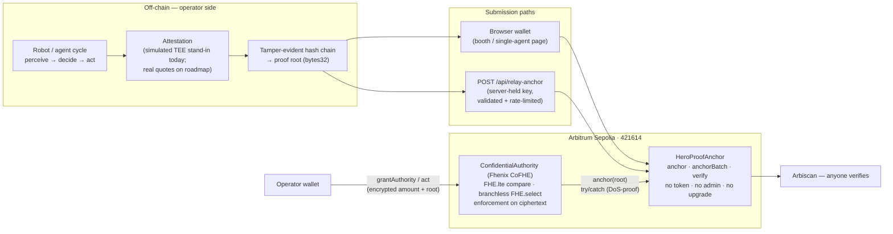

# Hero — confidential proof-of-action for autonomous agents

**An autonomous agent or robot proves it acted within its authority — anchored
and verifiable on Arbitrum — without revealing the authority or the action.**

Built for **Arbitrum Open House Founder House London (10–12 July 2026)** ·
Track: **Agentic AI**.

---

## Live

| Surface | Link |
|---|---|
| Hosted demo | https://hero-anchor.netlify.app |
| Stage demo — full-screen, self-narrating, real anchors + QR | https://hero-anchor.netlify.app/fleet?stage=1 |
| Robot fleet | https://hero-anchor.netlify.app/fleet |
| `HeroProofAnchor` — verified source | https://sepolia.arbiscan.io/address/0xb3fa3222130fac54b90e37835dce4f052349571b |
| `ConfidentialAuthority` — verified source | https://sepolia.arbiscan.io/address/0x977b112bc9d121c8f2567c8a52fd7b6a4f2cdd95 |

Both contracts are live on **Arbitrum Sepolia (chain id 421614)** with source
verified on Arbiscan. **18 real `ProofAnchored` events** are on-chain from a
full robot-fleet shift (2026-07-09).

---

## Why

Agent wallets (Coinbase, Crossmint, ERC-8004) put every limit and every action
on a public ledger — fine for a tip bot, fatal for anything regulated or
competitive. TEE-based "verifiable AI" asks you to trust hardware vendors
instead. Hero does both halves at once:

- **Verifiable** — a tamper-evident root of what the agent *did* is anchored on
  Arbitrum. Anyone verifies; no operator can rewrite it.
- **Confidential** — what the agent was *allowed* to do stays encrypted. The
  contract proves `action ≤ authority` on ciphertext (Fhenix CoFHE) without
  decrypting either. Math-trust, not hardware-trust.

Anchoring alone is cloneable in a day. The confidentiality is the moat.

---

## What's real vs simulated

We do not over-claim. As of today:

| Piece | Status |
|---|---|
| Anchoring on Arbitrum Sepolia (`HeroProofAnchor`) | **Real.** Every anchored fleet action is a real transaction, verifiable on Arbiscan. |
| Both contracts deployed + source-verified on Arbiscan | **Real.** |
| Cost numbers | **Real.** Measured from actual transaction receipts (table below). |
| Encrypted authority enforcement (`ConfidentialAuthority`, Fhenix CoFHE) | Deployed + verified + fully unit-tested. The live encrypted round trip on testnet is **pending** (the CoFHE coprocessor is testnet-grade). |
| Fleet per-robot budget check | **Simulated** — a local JS stand-in, labelled as such in the UI. The fleet proves *anchoring*; the encrypted check lives in the single-agent flow. |
| TEE attestation | **Simulated** stand-in (roadmap: real hardware quotes). |

---

## Measured cost

| Mode | Gas / action | Fee (ETH) | USD @ $3,000 ETH |
|---|---|---|---|
| Plain `anchor` — **measured** (real Sepolia receipts, 0.02 gwei) | 49,449 | 0.000000989 | **≈ $0.003** |
| Merkle-epoch batching — modelled (forge bench: `anchorBatch(20)` 24,835 exec gas/anchor vs 29,597 single; the 21k intrinsic amortises across the batch) | ≈ 26k | ≈ 0.00000052 | ≈ $0.0015 |
| Orbit AnyTrust L3 (roadmap) | — | — | → near zero |

Reproduce: `make gas` (forge bench + USD table).

---

## Architecture



Only proof roots and ciphertexts touch the chain. Raw action data and the
cleartext authority never do — that is what keeps it cheap and private.

Deeper reading: [`docs/ARCHITECTURE.md`](docs/ARCHITECTURE.md) (trust ladder,
design choices) · [`docs/PITCH.md`](docs/PITCH.md) ·
[`docs/DEMO.md`](docs/DEMO.md) (stage runbook) · [`SECURITY.md`](SECURITY.md)
(threat model, internal review).

---

## Quickstart

```bash
git clone git@github.com:joyosive/hero_london_house.git && cd hero_london_house
make install        # forge-std + CoFHE packages
forge test          # 18/18 — contracts + gas bench, no network needed

cd web && npm i
npm test            # 42/42 vitest — engines, relayer, stage sequencer
npm run dev         # http://localhost:3000
```

Deploy your own (Arbitrum Sepolia, throwaway key only):

```bash
cp .env.example .env    # RPC_URL, PRIVATE_KEY (testnet burner), ETHERSCAN_API_KEY
make deploy-verify      # deploy + verify on Arbiscan + auto-sync addresses into web/
```

CI (GitHub Actions) runs `forge test`, `tsc`, `vitest` and `next build` on
every push.

---

## Roadmap — the cost and trust curves

The anchor is deliberately minimal (no token, no admin keys, no upgradeability).
The next steps are about scale, cost and assurance, in order:

1. **Merkle-epoch batching.** One root per epoch of actions instead of one per
   action. Already modelled from the forge bench — ≈ halves per-action gas —
   and it makes per-action cost shrink as fleet activity grows.
2. **Stylus (Rust) verifier.** Move the hash-heavy verification path to
   Arbitrum Stylus (WASM). Cheaper for exactly this workload, Arbitrum-native,
   and plays to the team's Rust depth.
3. **Orbit AnyTrust L3 — "Hero Chain".** A dedicated AnyTrust chain for
   fleet-scale anchoring, settling to Arbitrum. Per-action cost approaches zero
   while the neutral settlement root remains.
4. **Real TEE quotes.** Replace the simulated attestation stand-in with
   hardware attestation bound into the hash chain. Attestation hardens the
   input; enforcement stays FHE — math-trust, not hardware-trust.

$0.003/action measured today → ≈ $0.0015 batched → near zero on an L3, with the
confidentiality layer intact at every step. Robot fleets act thousands of times
per shift; this is the curve that makes proof-per-action economical at that
scale — and every step of it is Arbitrum-native.

---

## Repository

- `src/HeroProofAnchor.sol` — neutral anchor: `anchor(bytes32)`,
  `anchorBatch(bytes32[])`, `verify(bytes32)`. No token, no admin, no
  upgradeability.
- `src/ConfidentialAuthority.sol` — encrypted authority per agent (Fhenix
  CoFHE): `FHE.lte` compare + branchless `FHE.select` decrement, agents keyed
  `keccak256(operator, agentId)`, permit-gated unseal. Composes
  `HeroProofAnchor`.
- `test/` — forge tests incl. gas bench (18/18)
- `web/` — Next.js app: fleet, stage mode, single-agent flow, `/api/relay-anchor`
- `offchain/` — hash-chain builder, gas/USD table, deploy sync
- `docs/` — architecture, pitch, demo runbook · `SECURITY.md` — threat model +
  internal review

---

## Team

**Hero** — an **H.E.R. DAO** project.

- **Tracey Bowen (Onallee)** — CEO
- **Joy (joyosive)** — CTO

Track: **Agentic AI** · Arbitrum Open House Founder House, London,
10–12 July 2026.
