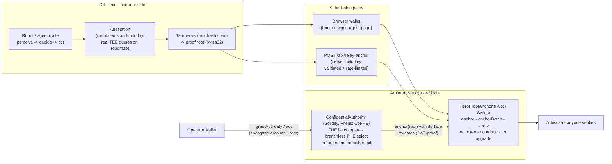

# Hero - the audit and verification portal for agents and physical AI

**Every action an autonomous agent or robot takes becomes a cryptographic proof,
for a fraction of a cent, verifiable by anyone - while the rules it runs under
stay sealed.** Not a certificate once a year: a receipt for every action.

Built for **Arbitrum Open House Founder House London (10-12 July 2026)** ·
Track: **Agentic AI**.

---

## The problem

Companies already pay on the order of **$265B a year** to prove their machines and
AI work: testing, inspection and certification (SGS, TUV, Bureau Veritas). But a
certificate is a snapshot, and **agents and robots change every update**. A human
certifies a system once; then the model updates and the certificate is stale,
performance is graded by the vendor on editable logs, and nobody can verify what
an autonomous system actually did in between.

Hero makes verification **continuous**: real-time, near-free, and confidential.

## The primitive

```
MANDATE -> ACT -> RECEIPT -> ANCHOR -> VERIFY
```

The operating envelope is **sealed with FHE** (Fhenix). Every action is checked
against the sealed authority on ciphertext and hash-chained into a receipt. A
32-byte root **anchors on Arbitrum**. Anyone verifies compliance, free, without
ever seeing the mandate or the action. One primitive whether the actor is a
software agent or a robot: a robot is an embodied agent, and the same engine
verifies both.

---

## On-chain, live on Arbitrum Sepolia (chain id 421614)

| Contract | Language | Address | Status |
|---|---|---|---|
| **HeroProofAnchor** | **Rust / Arbitrum Stylus** | [`0x75B1E0...181A`](https://sepolia.arbiscan.io/address/0x75B1E01222bC1bEFfd023A71762fec796FeE181A) | live + activated (Stylus/WASM on Arbiscan) |
| **ConfidentialAuthority** | Solidity + Fhenix CoFHE | [`0x28C695...1309`](https://sepolia.arbiscan.io/address/0x28C695859bfAc9bEBe6126AAE619E83e652a1309) | live + **source-verified** |

The neutral anchor is a **Rust contract on Arbitrum Stylus**. The confidential
authority is Solidity (Fhenix CoFHE is a Solidity toolkit) and calls the Rust
anchor through an interface. A Rust contract and a Solidity contract composing on
the same chain is exactly what Stylus is for.

- **Verifiable** - a tamper-evident root of what the agent *did* is anchored on
  Arbitrum. Anyone verifies; no operator can rewrite it (first-write-wins, no
  token, no admin, no upgrade).
- **Confidential** - what the agent was *allowed* to do stays encrypted. The
  authority proves `action <= authority` on ciphertext (Fhenix CoFHE), branchless,
  without decrypting either. Math-trust, not hardware-trust.

### Demo surfaces

| Surface | Link |
|---|---|
| Hosted portal | https://hero-authority.netlify.app |
| Robot fleet | https://hero-authority.netlify.app/fleet |
| Stage demo (full-screen, self-narrating, real anchors + QR) | https://hero-authority.netlify.app/fleet?stage=1 |

---

## What is real vs pending

We do not over-claim.

| Piece | Status |
|---|---|
| Rust/Stylus anchor deployed + activated on Arbitrum Sepolia | **Real.** Reads as a Stylus contract on Arbiscan. |
| ConfidentialAuthority deployed + **source-verified** on Arbiscan | **Real.** |
| Anchoring an action on-chain | **Real.** Each anchored action is a real transaction, verifiable on Arbiscan. |
| Encrypted authority enforcement (Fhenix CoFHE) | **Coded, deployed, verified, unit-tested.** The live encrypted round trip on testnet is **pending** an upstream cofhejs fix. |
| Fleet per-robot budget check in the browser | **Simulated** local stand-in, labelled in the UI. The fleet demo proves *anchoring*; the encrypted check lives in the single-agent flow. |
| Anchor **source** verification on Arbiscan | **Pending.** The cargo-stylus 0.10.8 reproducible-build image is not yet published to Docker Hub; the bytecode is Stylus-activated and the source is in this repo. |

Activation of the Rust anchor cost **0.000074 ETH** (measured); each anchor is a
fraction of a cent on Arbitrum.

---

## Security

The contracts hold no funds and expose no admin or upgrade paths. They went
through an internal adversarial review before deployment. A HIGH-severity finding
in the authority (the compliance flag was keyed by proof root alone, letting one
operator forge or clobber another's attestation) was fixed by namespacing the flag
per **(operator, agent, proof root)**, plus anti-replay and a real revoke gate.

Coverage: **forge 21/21, cargo 5/5**, including a named test for each fix
(`test_compliance_flag_is_operator_scoped`, `test_revoked_agent_cannot_act`,
`test_same_agent_cannot_reuse_proof_root`).

---

## Architecture



Only proof roots and ciphertexts touch the chain. Raw action data and the
cleartext authority never do; that is what keeps it cheap and private.

---

## Quickstart

```bash
make install                                        # forge-std + CoFHE packages
forge test                                          # 21/21 - Solidity authority + reference anchor + gas bench
( cd anchor && cargo test --features stylus-test )  # 5/5 - the Rust/Stylus anchor
( cd web && npm i && npm run dev )                  # http://localhost:3000
```

Deploy your own (Arbitrum Sepolia, throwaway key only):

```bash
# 1) the Rust/Stylus anchor
cd anchor
cargo stylus deploy -e $RPC_URL --private-key $PRIVATE_KEY --no-verify --max-fee-per-gas-gwei 1

# 2) the authority, pointed at the anchor from step 1 (ANCHOR_ADDRESS is required)
cd ..
ANCHOR_ADDRESS=0x<anchor> forge script script/Deploy.s.sol \
  --rpc-url $RPC_URL --broadcast --private-key $PRIVATE_KEY
```

CI (GitHub Actions) runs forge, vitest and next build on every push.

---

## One primitive, two surfaces

Hero is one verification engine underneath two products:

- **Physical AI** - robots, drones, warehouse fleets. This repo: the sealed-mandate
  fleet demo and the on-chain anchor + authority on Arbitrum Sepolia.
- **Agents** - software and trading agents. The same primitive secures trading-agent
  mandates as a sibling deployment.

A robot is an embodied agent; the engine that verifies a robot's actions verifies
an agent's trades.

---

## Roadmap

The anchor is deliberately minimal. Next, in order:

1. **Merkle-epoch batching** - one root per epoch of actions instead of one per
   action; per-action cost shrinks as fleet activity grows.
2. **Live FHE round trip** - the encrypted grant / act / reveal end to end on
   testnet, once the upstream cofhejs coprocessor fix lands.
3. **Orbit AnyTrust L3** - a dedicated chain for fleet-scale anchoring settling to
   Arbitrum; per-action cost approaches zero while the neutral settlement root
   remains.
4. **Real TEE quotes** - replace the simulated attestation stand-in with hardware
   attestation bound into the hash chain; enforcement stays FHE.

The Rust/Stylus anchor was previously a roadmap item; it is now **shipped** and is
the production anchor above.

---

## Repository

- `anchor/` - **HeroProofAnchor in Rust / Arbitrum Stylus** (production anchor):
  `anchor`, `anchorBatch`, `verify`. No token, no admin, no upgrade.
- `src/IHeroProofAnchor.sol` - the anchor interface the authority composes with.
- `src/HeroProofAnchor.sol` - Solidity reference implementation of the same ABI,
  for EVM tests and local anvil (the Stylus runtime cannot run inside Foundry).
- `src/ConfidentialAuthority.sol` - encrypted authority per agent (Fhenix CoFHE):
  `FHE.lte` compare + branchless `FHE.select` decrement, agents keyed
  `keccak256(operator, agentId)`, compliance flag namespaced per
  (operator, agent, root), permit-gated unseal.
- `test/` - forge tests including the gas bench (21/21).
- `web/` - Next.js app: fleet, stage mode, single-agent flow, `/api/relay-anchor`.
- `offchain/` - hash-chain builder, gas/USD table, deploy sync, CoFHE round-trip.

---

## Team

**Hero** - an **H.E.R. DAO** project.

- **Tracey Bowen** - founder. AI ethics and data research (Mozilla, Research
  England). Built H.E.R. DAO: 2,000+ builders, 20+ hubs. Creator of a global
  multi-agentic AI program for developers.
- **Joy Sethi** - technical co-founder. Built Mandala Chain (Substrate L1, native
  DID). Professor, George Brown College.
- **April Walker** - compliance and audit. Led QA and regulatory compliance for
  Uber London operations; audits across Transport for London.

Track: **Agentic AI** · Arbitrum Open House Founder House, London, 10-12 July 2026.
